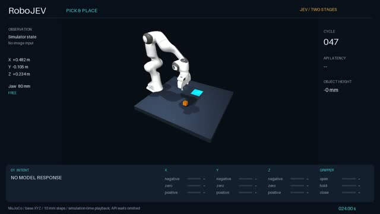
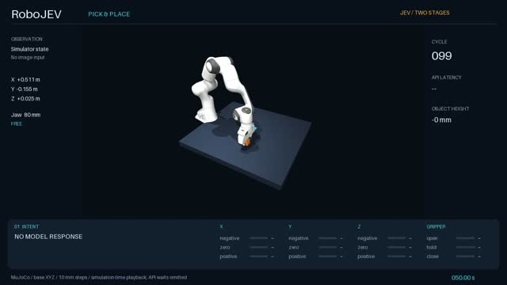

# RoboFastPath

RoboFastPath is a model-agnostic System-1 decision layer for embodied agents.
It evaluates fast, structured decision models inside real task loops and keeps
state interpretation, decision composition, action execution, and physical
success checks separate.

The first reproduction integrates
[Decision-1.0-Nox-4B](https://huggingface.co/llm-semantic-router/Decision-1.0-Nox-4B)
with [RoboJEV](https://github.com/lykycy123/RoboJEV) pick-and-place. Native
eight-way `Choice` control did not complete any of ten episodes. A predicate-first
design instead asks the model seven local `Noul` questions, combines the answers
with an explicit intent table, and executes deterministic geometric actions.
On preregistered seeds 2000–2009, this path completed 9/10 episodes; the same
runtime with exact code predicates completed 10/10.

These results show that the model/runtime split is viable. They do not show that
the model is better than rules: every predicate in this first task can be
computed exactly from privileged simulator state.

## Rollout videos

Click a preview to open the full MP4 recording.

**Exact code predicates — seed 2000, success**

[](docs/videos/exact-code-seed-2000.mp4)

**Nox mixed predicates — seed 2001, success**

[](docs/videos/nox-mixed-success-seed-2001.mp4)

**Nox mixed predicates — seed 2000, failure**

[](docs/videos/nox-mixed-failure-seed-2000.mp4)

The failure recording is the only failed mixed episode in seeds 2000–2009. It
reaches the 200-decision limit near the grasp transition; it is included so the
public artifact preserves the reported failure rather than showing only
successful rollouts.

## Architecture

```text
RoboJEV state snapshot
        │
        ├── System-1 provider ──► typed local predicates + confidence
        │
        └── code control ───────► exact predicates
                                  │
                         shared intent table
                                  │
                    deterministic action mapping
                                  │
                    RoboJEV controller + evaluator
```

The model never declares physical success. RoboJEV executes the action and owns
the task verdict. The code and model conditions share the same composition and
motion implementation, so their first behavioral divergence is observable.

## Reproduce the RoboJEV experiment

Requirements:

- Linux, Python 3.11 or 3.12, and MuJoCo with OSMesa
- a running `/v1/systemone` endpoint for the model condition
- one GPU supported by the selected decision-model runtime

Set up the pinned RoboJEV checkout:

```bash
git clone https://github.com/ZJLi2013/RoboFastPath.git
cd RoboFastPath
bash scripts/run_robojev.sh setup
```

Run the deterministic control and the Nox-backed condition:

```bash
bash scripts/run_robojev.sh code

export ROBOFASTPATH_URL=http://127.0.0.1:30001/v1/systemone
export ROBOFASTPATH_MODEL=Decision-1.0-Nox-4B
bash scripts/run_robojev.sh mixed

bash scripts/run_robojev.sh analyze
```

Each condition uses seeds 2000–2009 by default. Override `SEED`, `EPISODES`,
`WORK`, or `MUJOCO_GL` through environment variables. See
[`docs/reproduction.md`](docs/reproduction.md) for the model server, native
baseline, expected outputs, and failure diagnosis.

## Repository layout

```text
robofastpath/
  robojev.py        # predicates, intent composition, deterministic motion
  systemone.py      # provider-neutral HTTP decision client
examples/robojev/
  policy.py         # RoboJEV policy adapter and shadow code decision
  run.py            # unmodified RoboJEV CLI with local policies injected
  analyze.py        # per-episode stages, divergence, latency, and tokens
providers/nox/
  serve.py          # minimal HTTP wrapper around the official Decision runtime
scripts/
  run_robojev.sh    # setup and frozen evaluation commands
tests/
  test_robojev.py   # composition and motion contract tests
```

## Extension boundary

RoboFastPath is intended to grow along three independent axes:

1. **Decision models:** add providers without changing tasks.
2. **Embodied tasks:** add task adapters with explicit state, predicate, action,
   and verifier contracts.
3. **Runtime policies:** compare direct choice, predicate composition,
   confidence-gated escalation, and learned policies under the same evaluator.

The System-1 layer returns bounded judgments. Planning, action execution, and
success verification remain explicit owners in the embodied pipeline.

## Current limits

- The released experiment covers one RoboJEV task and one learned decision model.
- Nox reads privileged structured simulator state, not camera observations.
- The code baseline is stronger and cheaper on this task.
- The 9/10 result has a wide interval; it is evidence for the interface, not a
  general robotics capability claim.
- Real-robot transfer has not been tested.

## Upstream projects

- [RoboJEV](https://github.com/lykycy123/RoboJEV), pinned by the reproduction script
- [Decision-1.0-Nox-4B](https://huggingface.co/llm-semantic-router/Decision-1.0-Nox-4B)
- [LLM2Jev](https://github.com/tic-top/llm2jev), a provider-neutral Jev-compatible
  readout for chat models

## AI usage disclosure

The experiment design, implementation, analysis scripts, migration, and
documentation were developed with Cursor agents under human direction. The
maintainer selected the research question, supervised the runs, reviewed the
evidence, and is responsible for the published claims and code.
